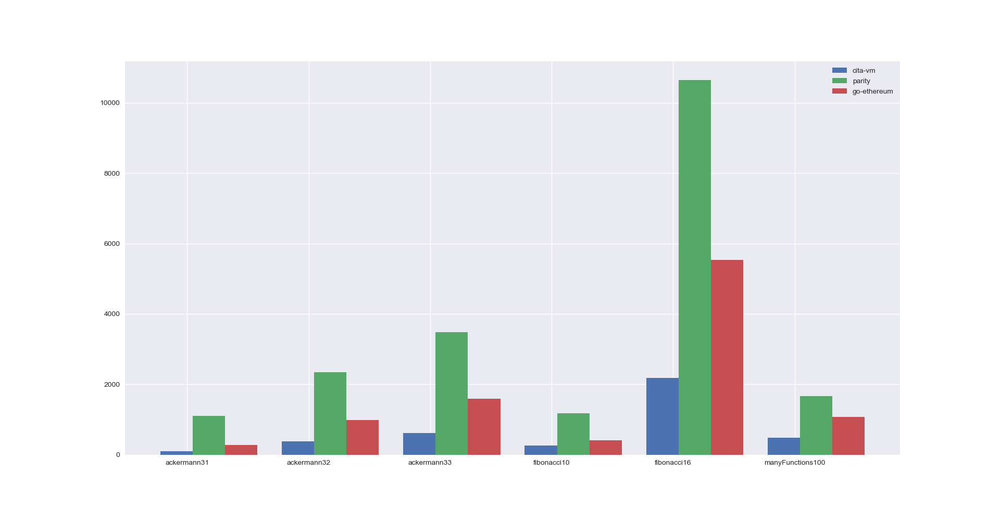
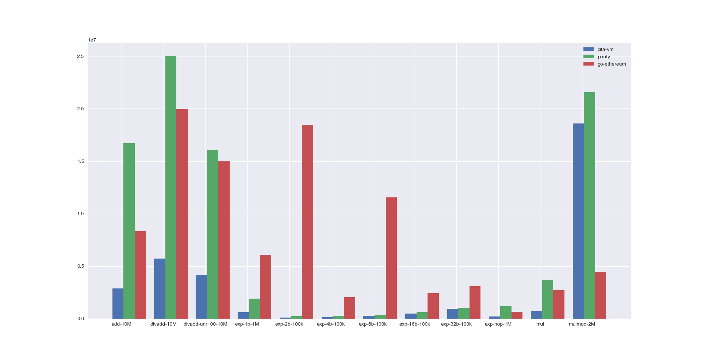

# cita-vm

Fast EVM implementation for CITA. Tuned for high performance. Up to 5x faster than parity.

# Performance comparison with parity and geth

In short, cita-vm is the fastest EVM. Below are [benchmark](https://github.com/ethereum/tests/tree/develop/VMTests/vmPerformance) results on **Intel(R) Xeon(R) CPU E5-26xx v3**.

# Install

To be added.

# FAQ

To be added.
